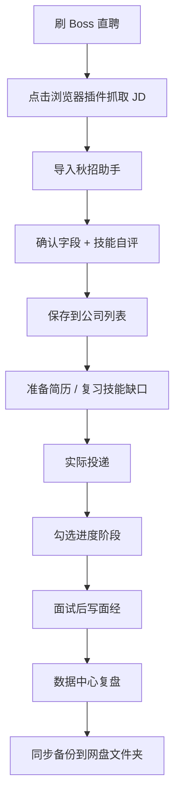
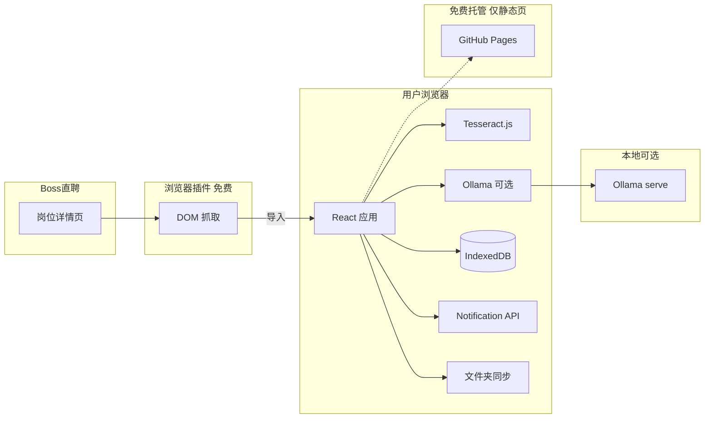

# 秋招助手 — 网站计划书

> 版本：v2.0（Phase 1–4 全部完成）  
> 定位：个人秋招 / 春招投递管理工具  
> 原则：**零成本、本地优先、针对每家公司定制化管理**

---

## 一、项目背景

### 1.1 要解决什么问题

秋招 / 春招期间，通常会同时投递几十上百家公司。每家公司存在以下差异：

| 差异点 | 实际困扰 |
|--------|----------|
| 招聘要求不同 | 需要针对性准备简历和复习内容 |
| 进度不同步 | 容易忘记哪家投了、哪家在等笔试 |
| 截止时间分散 | 网申截止日容易漏 |
| 面经零散 | 面试完不记录，下一家准备效率低 |
| 数据来源分散 | Boss 直聘、官网、内推等多渠道 |

现有工具（Excel、备忘录）难以同时满足：**看要求、跟进度、记面经、设提醒**。

### 1.2 产品目标

构建一个 **个人投递管理网站**，实现：

1. 从 Boss 直聘快速录入岗位信息（插件 / Ollama / OCR / 粘贴）
2. 按公司跟踪投递全流程进度
3. 记录面经、联系人、简历版本
4. 截止日与面试日程提醒
5. 数据统计、日历、待办复盘
6. 整体成本 **0 元**

### 1.3 目标用户

- 主要用户：你自己（单用户本地使用）
- 使用场景：秋招、春招、日常实习 / 社招投递

---

## 二、产品定位

```
Boss 直聘 JD  →  录入系统  →  针对性准备  →  投递跟踪  →  复盘沉淀
     ↑              ↑              ↑              ↑              ↑
  插件/OCR      结构化字段      技能自评        进度勾选        面经/数据
  Ollama解析    联系人/简历     待办提醒        日历视图        CSV导出
```

**一句话定位**：  
> 把 Boss 直聘上的招聘信息，变成可跟踪、可提醒、可复盘的个人秋招工作台。

**不做的事（控制范围）**：

- 不做多人在线协作
- 不做付费 OCR / 云端 AI API
- 不做自动代投简历
- 不做 Boss 直聘官方 API 对接

---

## 三、功能规划

### 3.1 功能总览

| 模块 | 功能 | 状态 |
|------|------|------|
| 投递看板 | 公司列表、状态/赛季/年份筛选、搜索、今日待办预览 | ✅ 已完成 |
| 公司录入 | 插件导入、剪贴板导入、Ollama 解析、截图 OCR、JD 粘贴 | ✅ 已完成 |
| 公司编辑 | 修改信息、截止日期、技能自评、联系人 | ✅ 已完成 |
| 进度跟踪 | 网申→简历→笔试→面试→OC，阶段勾选 | ✅ 已完成 |
| 阶段增强 | 安排时间、阶段备注、浏览器日程提醒 | ✅ 已完成 |
| 技能匹配度 | JD 技能 + 自评（会 / 需复习 / 不会）+ 掌握率 | ✅ 已完成 |
| 日历视图 | 按周展示笔试、面试、截止日 | ✅ 已完成 |
| 数据中心 | 状态分布、转化漏斗、今日待办、技能缺口 | ✅ 已完成 |
| 面经笔记 | 独立笔记页、按公司关联、标签、编辑 | ✅ 已完成 |
| 简历版本 | 版本管理 + PDF 本地存储（IndexedDB） | ✅ 已完成 |
| 联系人 | 内推人、HR 姓名与联系方式 | ✅ 已完成 |
| 浏览器提醒 | 截止日提醒、笔试/面试日程提醒 | ✅ 已完成 |
| 深色模式 | 浅色 / 深色 / 跟随系统 | ✅ 已完成 |
| PWA | 安装到桌面、离线访问页面 | ✅ 已完成 |
| 数据备份 | JSON 完整备份（含 PDF Base64） | ✅ 已完成 |
| CSV 导出 | Excel 可打开的投递记录报表 | ✅ 已完成 |
| 文件夹同步 | 写入 OneDrive / 百度网盘同步目录 | ✅ 已完成 |
| Boss 浏览器插件 | 岗位页一键抓取 JD 并导入 | ✅ 已完成 |
| Ollama 本地 AI | 结构化 JD 解析（可选） | ✅ 已完成 |
| 免费部署 | GitHub Pages + Actions 自动构建 | ✅ 已完成 |

### 3.2 核心页面结构

```
秋招助手
├── 看板（/）                    公司卡片、筛选、今日待办预览
├── 日历（/calendar）            按周查看笔试/面试/截止
├── 数据（/stats）               统计漏斗、待办、技能缺口、CSV 导出
├── 添加公司（/company/new）     插件/Ollama/OCR/粘贴录入
├── 编辑公司（/company/:id/edit）修改信息与技能自评
├── 公司详情（/company/:id）     进度、要求、面经、联系人、简历
├── 简历（/resumes）             版本管理 + PDF 上传/下载
├── 面经（/notes）               全部笔记、搜索、按公司筛选
└── 设置（/settings）            插件说明、Ollama、文件夹同步、主题、提醒、备份
```

### 3.3 投递进度模型

默认阶段（可自定义追加）：

```
网申 → 简历投递 → 笔试 → 一面 → 二面 → HR面 → OC
                                              ↘ 拒信
```

每个阶段包含：

| 字段 | 说明 |
|------|------|
| 状态 | 未开始 / 进行中 / 已完成 / 已跳过 |
| 安排时间 | 用于浏览器日程提醒 + 日历展示 |
| 阶段备注 | 会议链接、地点、注意事项 |
| 完成时间 | 勾选完成时自动记录 |

系统自动推断公司总状态：

```
待投递 → 已投递 → 笔试中 → 面试中 → 已OC / 已结束
```

### 3.4 公司信息模型

| 字段 | 来源 | 说明 |
|------|------|------|
| 公司名称 | 插件 / OCR / 手动 | 必填 |
| 岗位 | 插件 / OCR / 手动 | 必填 |
| 赛季 | 手动 | 秋招 / 春招 / 实习 / 社招 |
| 年份 | 手动 | 2025 / 2026 … |
| 地点 / 薪资 | 插件 / OCR | 选填 |
| 截止日期 | 手动 | 用于截止提醒 + 日历 |
| 任职要求 / 职责 | 插件 / OCR / Ollama | 复习参考 |
| 技能标签 | 自动提取 | Java、算法、React 等 |
| 技能自评 | 手动 | 会 / 需复习 / 不会 |
| 原始 JD | 插件 / OCR 全文 | 备查 |
| Boss 链接 | 插件 / 手动 | 快速跳回 |
| 内推人 / 联系方式 | 手动 | Phase 3 |
| HR / 联系方式 | 手动 | Phase 3 |
| 关联简历版本 | 手动 | 记录投的是哪版 PDF |

### 3.5 面经笔记模型

| 字段 | 说明 |
|------|------|
| 标题 | 如「字节一面 - 项目深挖」 |
| 内容 | 题目、回答、反思 |
| 关联公司 | 可选 |
| 阶段 | 笔试 / 一面 / 二面 … |
| 标签 | 算法、项目、Java … |
| 时间 | 创建 / 更新时间 |

---

## 四、用户使用流程

### 4.1 日常主流程（推荐：浏览器插件）



### 4.2 录入方式对比

| 方式 | 准确度 | 费用 | 适用场景 |
|------|--------|------|----------|
| **Boss 浏览器插件** | 高 | 0 元 | 日常使用（推荐） |
| **Ollama 本地 AI** | 高 | 0 元 | JD 已粘贴，需智能结构化 |
| **JD 文本粘贴** | 中 | 0 元 | 无法装插件时 |
| **截图 OCR** | 中低 | 0 元 | 只能截图时 |

**插件安装**：`chrome://extensions` → 开发者模式 → 加载 `extension` 文件夹（详见 `extension/README.md`）

### 4.3 提醒与日历

1. 设置页 → 开启浏览器通知
2. 公司详情 → 填写「截止日期」
3. 各阶段 → 填写「安排时间」
4. 日历页 / 数据页查看安排；系统自动推送提醒

### 4.4 备份与多设备

| 方式 | 说明 |
|------|------|
| JSON 导出 | 完整备份，含 PDF 简历 |
| CSV 导出 | 投递记录汇总，Excel 打开 |
| 文件夹同步 | 写入 OneDrive / 百度网盘目录，手动恢复 |
| 换浏览器 | 导入 JSON 备份 |

---

## 五、技术方案（零成本）

### 5.1 技术栈

| 层级 | 选型 | 原因 |
|------|------|------|
| 前端框架 | React + TypeScript | 组件化、类型安全 |
| 构建工具 | Vite | 轻量、快速 |
| 路由 | React Router | 多页面导航 |
| 本地数据库 | IndexedDB（Dexie） | 零服务器、支持 Blob |
| OCR | Tesseract.js | 浏览器本地，免费 |
| AI 解析 | Ollama（本地） | 可选，不上云 |
| 数据采集 | Chrome Extension MV3 | Boss 直聘 DOM 抓取 |
| 通知 | Notification API | 系统原生提醒 |
| 离线 | vite-plugin-pwa | 安装到桌面 |
| 文件夹同步 | File System Access API | 写入网盘同步目录 |
| 部署 | GitHub Pages + Actions | 免费静态托管 |

### 5.2 架构图



### 5.3 成本预算

| 项目 | 方案 | 月费用 |
|------|------|--------|
| 服务器 | 不需要 | 0 元 |
| 数据库 | IndexedDB 本地 | 0 元 |
| OCR | Tesseract.js 本地 | 0 元 |
| AI | Ollama 本地（可选） | 0 元 |
| 浏览器插件 | 开发者模式本地加载 | 0 元 |
| 通知 / PWA | 浏览器原生 | 0 元 |
| 网盘同步 | 手动写入同步文件夹 | 0 元 |
| 托管 | GitHub Pages | 0 元 |
| **合计** | | **0 元/月** |

### 5.4 数据安全与备份

- 数据默认 **不上传任何服务器**，存在本机浏览器 IndexedDB
- 清浏览器缓存可能丢失数据 → 需定期备份
- 推荐策略：
  1. **每周**：设置 → 立即同步备份（网盘文件夹）
  2. **重要节点**：导出 JSON 到 U 盘 / 网盘
  3. **换设备**：导入 JSON 或从同步文件夹恢复

---

## 六、部署方案

### 6.1 本地使用

```bash
npm install
npm run dev
# 浏览器访问 http://localhost:5173
```

### 6.2 GitHub Pages（手机 / 多设备访问页面）

1. GitHub 创建仓库，推送代码
2. Settings → Pages → Source 选 **GitHub Actions**
3. 推送 `main` 分支，Actions 自动构建
4. 访问 `https://<用户名>.github.io/<仓库名>/`
5. 浏览器「安装应用 / 添加到主屏幕」

> **注意**：Pages 只托管网页，**业务数据仍在各设备浏览器本地**。多设备同步靠 JSON / 文件夹备份，不是靠云端数据库。

### 6.3 浏览器插件

1. 打开 `chrome://extensions`，开启开发者模式
2. 「加载已解压的扩展程序」→ 选择项目内 `extension/` 目录
3. 插件设置中填写秋招助手地址（本地或 Pages URL）

---

## 七、开发路线图

### Phase 1 — MVP ✅

- [x] 公司 CRUD + 投递看板
- [x] Boss 截图 OCR + JD 粘贴
- [x] 进度阶段勾选
- [x] 面经笔记
- [x] 浏览器提醒
- [x] JSON 备份
- [x] GitHub Actions 部署

### Phase 2 — 效率提升 ✅

- [x] 日历视图（按周展示笔试 / 面试 / 截止）
- [x] 数据统计（漏斗、OC 率、状态分布）
- [x] 技能匹配度（会 / 需复习 / 不会）
- [x] 今日待办清单
- [x] 公司编辑页

### Phase 3 — 体验完善 ✅

- [x] 简历 PDF 本地存储（IndexedDB Blob）
- [x] 内推人 / HR 联系人字段
- [x] 深色模式
- [x] PWA（添加到手机桌面）
- [x] 导出 CSV 报表

### Phase 4 — 可选进阶 ✅

- [x] Boss 直聘浏览器插件（`extension/`）
- [x] Ollama 本地 AI 结构化解析
- [x] 网盘文件夹同步备份

### 后续可选（未规划）

- [ ] Boss 页面改版后更新插件选择器
- [ ] Ollama 视觉模型（截图直接识别，需本地 GPU）
- [ ] 自动定时备份（需保持页面打开或 Service Worker 增强）

---

## 八、页面线框说明

### 8.1 导航结构

```
看板 | 日历 | 数据 | 添加 | 简历 | 面经 | 设置
```

### 8.2 看板页

```
┌──────────────────────────────────────────────────────────┐
│ 秋招助手     看板 | 日历 | 数据 | 添加 | 简历 | 面经 | 设置 │
├──────────────────────────────────────────────────────────┤
│ 投递看板                    [今日待办] [+ 添加公司]        │
│ [总计 12] [进行中 8] [面试中 3] [临近截止 2]              │
│ 今日待办 (3) ─────────────────────────────────────       │
│ [搜索...] [秋招▼] [2026▼] [全部状态▼]                    │
│ ┌──────────┐ ┌──────────┐ ┌──────────┐                  │
│ │ 字节跳动  │ │ 腾讯     │ │ 美团     │                  │
│ │ 后端开发  │ │ 客户端   │ │ 算法     │                  │
│ │ 面试中    │ │ 笔试中   │ │ 3天后截止 │                  │
│ └──────────┘ └──────────┘ └──────────┘                  │
└──────────────────────────────────────────────────────────┘
```

### 8.3 添加公司页

```
┌──────────────────────────────────────────────────────────┐
│ 添加公司                                                  │
├──────────────────────┬───────────────────────────────────┤
│ 录入 JD               │ 确认信息                          │
│ [从剪贴板导入]        │ 公司 / 岗位 / 赛季 / 截止日       │
│ [Ollama 智能解析]     │ 技能匹配度（会/需复习/不会）      │
│ [截图 OCR 备选]       │ 内推人 / HR 联系人                │
│ [粘贴 JD 文本]        │ 关联简历版本                      │
│                      │ [保存并开始跟踪]                   │
└──────────────────────┴───────────────────────────────────┘
```

---

## 九、成功指标（个人使用）

| 指标 | 目标 |
|------|------|
| 投递公司数 | 全部录入，不遗漏 |
| 截止遗漏率 | 0（提醒 + 日历 + 看板） |
| 面经记录率 | 每次面试后当天记录 |
| 数据备份 | 至少每周 1 次（文件夹或 JSON） |
| 单公司录入耗时 | < 1 分钟（插件导入 + 确认） |

---

## 十、风险与应对

| 风险 | 影响 | 应对 |
|------|------|------|
| Boss 页面改版 | 插件抓取失败 | 改用粘贴 / OCR；更新 `content-zhipin.js` 选择器 |
| OCR 识别不准 | 字段错误 | 优先用插件；识别后人工确认 |
| Ollama 未启动 | 智能解析不可用 | 自动回退规则解析；设置页测试连接 |
| 浏览器清缓存 | 数据丢失 | JSON 备份 + 文件夹同步 |
| 通知不推送 | 错过日程 | 日历页 + 数据中心待办 |
| 多设备数据不一致 | 体验割裂 | 网盘文件夹恢复 / JSON 导入 |
| GitHub Pages 仅托管页面 | 误以为数据上云 | 文档与设置页说明 |

---

## 十一、总结

**秋招助手** 是一个面向个人、**四阶段全部落地**的零成本秋招工作台：

| 阶段 | 核心价值 |
|------|----------|
| Phase 1 | 能用：看板、进度、面经、提醒、备份 |
| Phase 2 | 高效：日历、统计、待办、技能自评、编辑 |
| Phase 3 | 完善：PDF 简历、联系人、深色模式、PWA、CSV |
| Phase 4 | 进阶：Boss 插件、Ollama、网盘文件夹同步 |

**推荐工作流**：Boss 插件导入 → 技能自评 → 跟踪进度 → 写面经 → 数据中心复盘 → 文件夹备份。

---

## 附录 A：快速启动

```bash
cd D:\visualStudio_project\resume
npm install
npm run dev
```

本地访问：http://localhost:5173

## 附录 B：Ollama（可选）

```bash
ollama pull llama3.2
ollama serve
```

设置页 → 启用 Ollama → 测试连接 → 添加公司时使用「Ollama 智能解析」

## 附录 C：项目目录

```
resume/
├── src/                 React 应用源码
├── extension/           Boss 直聘浏览器插件
├── .github/workflows/   GitHub Pages 自动部署
├── PLAN.md              本计划书
└── README.md            快速说明
```
